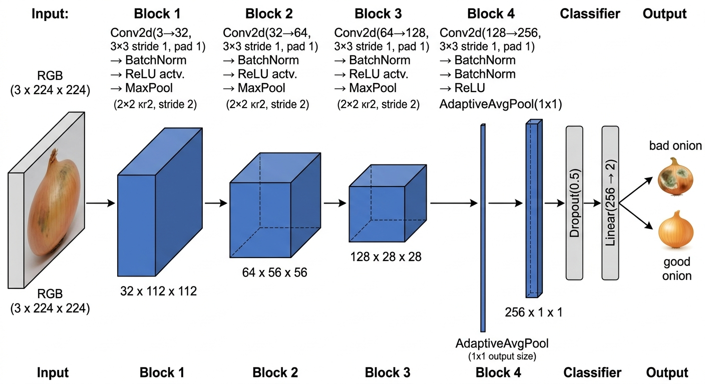

# Onion Quality Classifier

CNN that classifies onions as **good** or **bad** from images.

## Model — OnionNet

4-block CNN with BatchNorm, Dropout, and Global Average Pooling. Built for small datasets (~56 images). Trained from scratch with stratified 70/15/15 split.



**Architecture:** Input (3x224x224) → Conv32 → Conv64 → Conv128 → Conv256 → GAP → Dropout(0.5) → FC(2)

**Params:** ~390K

## Run

```bash
# train
uv run python -m onion.train

# start the API server
uv run uvicorn onion.app:app --reload

# predict (POST an image)
curl -X POST http://localhost:8000/predict -F "file=@path/to/onion.jpg"
```
